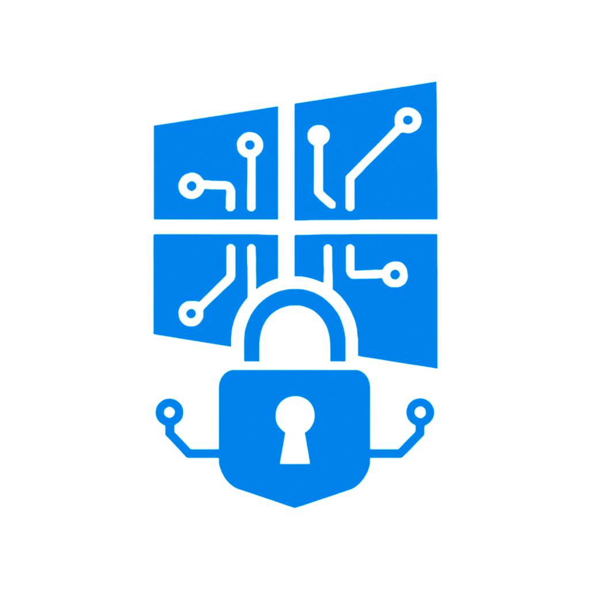

> **Windows and Hackers**  
> Scripts/PoCs/Toolkits for personal use and for studying exploitation in Windows environments

---

## 📁 Index

### 🔹 Toolsets
- [POC-ProcessInjection-C++](./POC-ProcessInjection-C++) – Simple payload for hacking Windows and process injection. Using the windows API.
- [CoverYourTracks](./CoverYourTracks) - Anti-forensics and footprint reduction toolkit
- [Enumeration](./Enumeration) - List of sensitive files or potential misconfigurations and vulnerabilities
- ⏰ [Obfuscation](./Obfuscation) - Reverse shell [Powershell obfuscation] - (Researching...)
- ⏰ [Post-Exploitation](./Post-Exploitation) - (Researching...)
  
---

## 📄 License

This project is licensed under the terms of the **MIT License**.  
See the [LICENSE](./LICENSE) file for more details.

---
